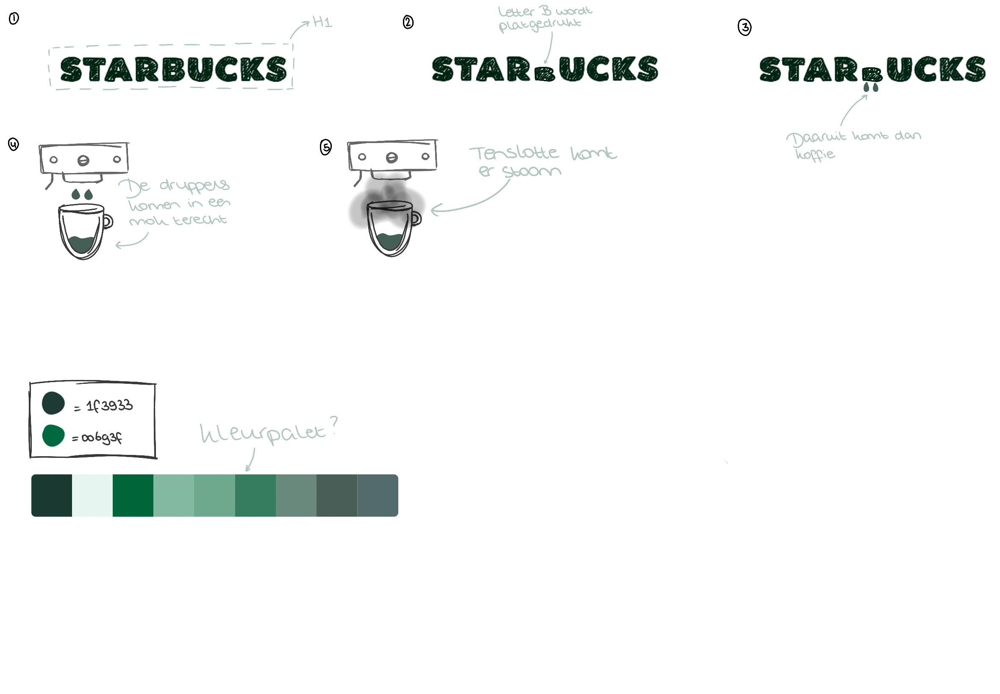
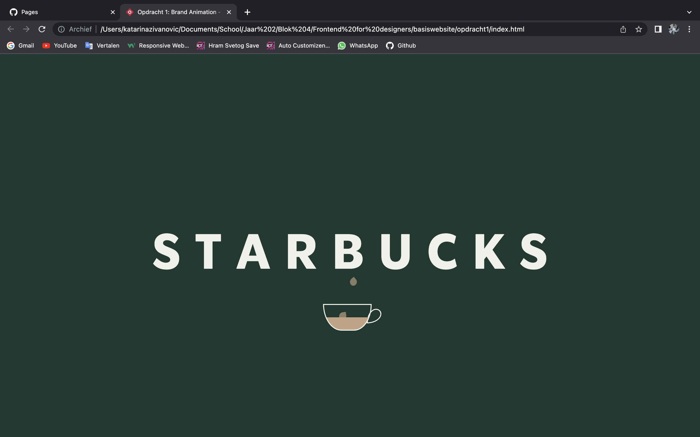
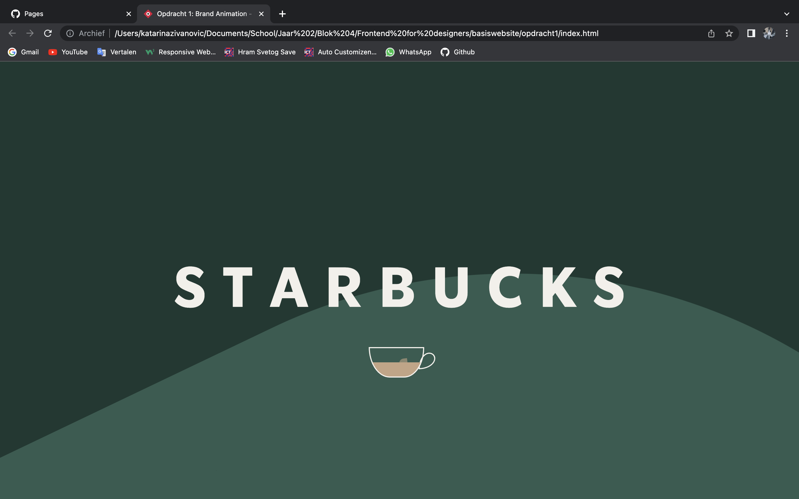
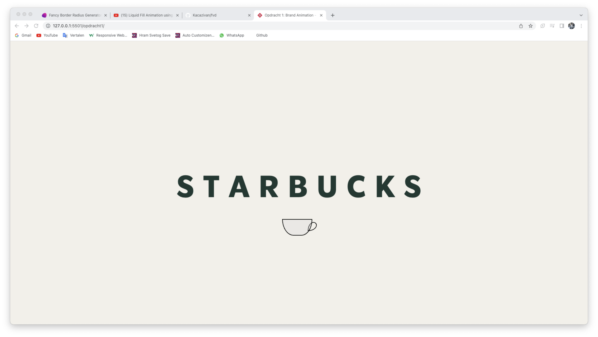
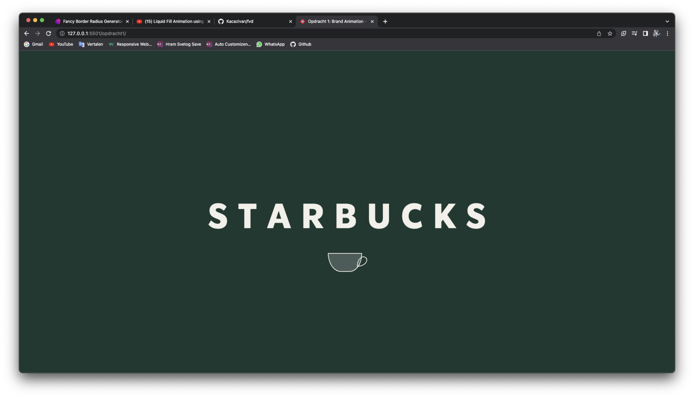
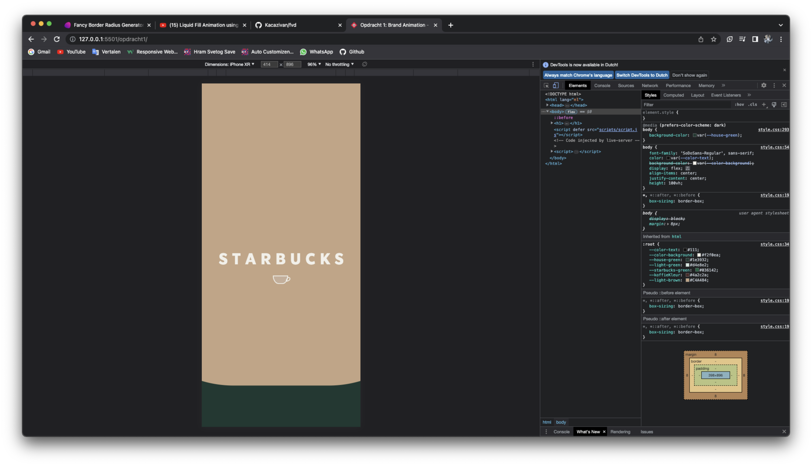

# Procesverslag
**Auteur:** -jouw naam-

**De opdrachten:** [opdracht 1](opdracht1/index.html) en [opdracht 2](opdracht2/index.html)

Markdown is een simpele manier om HTML te schrijven.  
Markdown cheat cheet: [Hulp bij het schrijven van Markdown](https://github.com/adam-p/markdown-here/wiki/Markdown-Cheatsheet).

Nb. De standaardstructuur en de spartaanse opmaak van de README.md zijn helemaal prima. Het gaat om de inhoud van je procesverslag. Besteedt de tijd voor pracht en praal aan je website.

Nb. Door *open* toe te voegen aan een *details* element kun je deze standaard open zetten. Fijn om dat steeds voor de relevante stuk(ken) te doen.

## Bronnenlijst
  1. Flexbox = https://ishadeed.com/article/learn-css-centering/#:~:text=To%20center%20an%20inline%20element,is%20text%2Dalign%3A%20center%20.&text=For%20multiple%20inline%20elements%2C%20the,using%20text%2Dalign%3A%20center%20. 
  2. clamp = https://www.youtube.com/watch?v=erqRw3E-vn4 
  3. Light and Dark mode = https://www.youtube.com/watch?v=nQzRTsjBXfQ
  4. Animation-fill-mode = https://developer.mozilla.org/en-US/docs/Web/CSS/animation-fill-mode 
  5. Scale = https://www.youtube.com/watch?v=L4RYwQM_Wvk
  6. Fade-in & Fade-out = https://www.youtube.com/watch?v=UInN6O_nMKs 
  7. Koffie vulling = https://www.youtube.com/watch?v=wGPDuqgkoew 
  8. Dark and Light mode = https://www.youtube.com/watch?v=nQzRTsjBXfQ 

## Opdracht 1 plan

  
uitwerken na schetsen idee (voor week 2)

  ### Je storyboard:
  

  ### Je ambitie: 
  Aan deze technieken/punten wil ik werken:
  - Effecten als stoom leren coderen.
  - Een koffie automaat coderen m.b.v. svgtjes?
  - En natuurlijk letters leren animeren, want dat heb ik nog nooit gedaan.

  Dus het zal zeker een uitdaging zijn :)
 

## Opdracht 1 reflectie

  
uitwerken bij afronden opdracht (voor week 4)

  ### Je uitkomst - karakteristiek screenshot(s):
  
  Als je op de hoofdpagina komt krijg je de tekst "Starbucks" met een beker te zien. De kleuren die je op dat moment ziet hangt af van je preferences. Dus als je light mode hebt krijg je wat lichtere kleuren te zien en als je dark mode aan hebt staan krijg je wat donkere kleuren te zien. Dit heb ik gedaan door de roots te veranderen met @media (prefers-color-scheme:dark). Mijn stukje code voor dit onderdeel zag er 
  zo uit:

  :root {
		--letter-color:var(--starbucks-light-green);
    --coffee-color:var(--ijskoffie-licht-bruin);
    --Koffiefill-color:var(--dark-mode-coffeeFill);
    --KoffieDruppel-color: var(--ijskoffie-licht-bruin);
    --koffie-in-beker: var(--ijskoffie-licht-bruin);
    --koffie-beker-border: var(--darkMode-koffieBeker-border);
    --achtergrond-kleur: var(--starbucks-house-green);
    --letter-color:var(--darkmode-color-text);
  }

  
  
  

  ### Dit ging goed/Heb ik geleerd: 
  De Dark and light mode ging erg goed bij mij, ik begreep het ook erg snel. Ik vond het ook erg leuk
  om hiermee met kleuren te spelen.

  
  

  ### Dit was lastig/Is niet gelukt:
  Het is me niet gelukt om een automaat en stoom te maken zonder een div/svg/img, omdat het te moeilijk
  voor me werd. Dit vond ik eigenlijk ook best pittig om te maken, omdat ik heel vaak vastliep bij bepaalde punten. Daarnaast lukt me het niet om de koffiegolf op mobielformaat groter te maken. Op mobielformaat bleef er namelijk nog een stukje witruimte over. Ook doet mijn letter B animatie het niet meer, terwijl hij het eerst wel deed. Eefje en ik konden beiden het probleem niet vinden. Wat ik echt jammer vind, want dat maakte deze wesbite eigenlijk compleet. 

  

## Opdracht 2 plan

  
uitwerken na schetsen idee (voor week 5)

  ### Je ontwerp:
  

  ### Je ambitie: 
  Aan deze technieken/punten wil ik werken:
  - punt 1
  - punt 2
  - nog een punt
  - ...

## Opdracht 2 test

  
uitwerken na testen (week 7)

  Neem minimaal 5 bevindingen op:

  ### Bevinding 1:
  Omschrijving van wat er nog niet orde was (tekst en afbeeding(en)).

  #### oplossing:
  Beschrijving hoe je het hebt hebt opgelost of als het niet gelukt is hoe je het zou oplossen (tekst en afbeeding(en)).

  ### Bevinding 2:
  Omschrijving van wat er nog niet orde was (tekst en afbeeding(en)).

  #### oplossing:
  Beschrijving hoe je het hebt hebt opgelost of als het niet gelukt is hoe je het zou oplossen (tekst en afbeeding(en)).

  ### Bevinding 3:
  ...

## Opdracht 2 reflectie

  
uitwerken bij afronden opdracht (voor week 8)

  ### Je uitkomst - karakteristiek screenshot(s):
  

  ### Dit ging goed/Heb ik geleerd: 
  Korte omschrijving met plaatje(s)

  

  ### Dit was lastig/Is niet gelukt:
  Korte omschrijving met plaatje(s)

  

