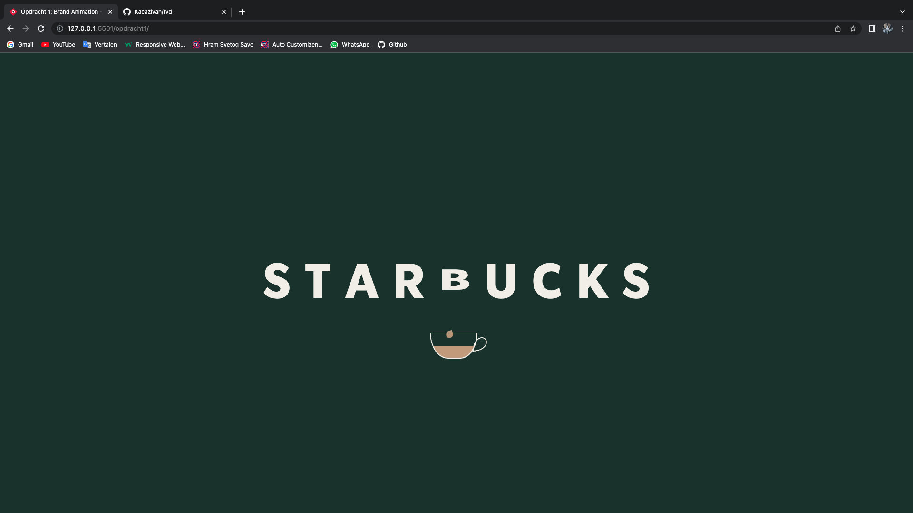

# Procesverslag
**Auteur:** Katarina Živanović

**De opdrachten:** [opdracht 1](opdracht1/index.html) en [opdracht 2](opdracht2/index.html)

Markdown is een simpele manier om HTML te schrijven.  
Markdown cheat cheet: [Hulp bij het schrijven van Markdown](https://github.com/adam-p/markdown-here/wiki/Markdown-Cheatsheet).

Nb. De standaardstructuur en de spartaanse opmaak van de README.md zijn helemaal prima. Het gaat om de inhoud van je procesverslag. Besteedt de tijd voor pracht en praal aan je website.

Nb. Door *open* toe te voegen aan een *details* element kun je deze standaard open zetten. Fijn om dat steeds voor de relevante stuk(ken) te doen.

## Bronnenlijst
  1. Flexbox = https://ishadeed.com/article/learn-css-centering/#:~:text=To%20center%20an%20inline%20element,is%20text%2Dalign%3A%20center%20.&text=For%20multiple%20inline%20elements%2C%20the,using%20text%2Dalign%3A%20center%20. 
  2. Clamp = https://www.youtube.com/watch?v=erqRw3E-vn4 
  3. Light and Dark mode = https://www.youtube.com/watch?v=nQzRTsjBXfQ
  4. Animation-fill-mode = https://developer.mozilla.org/en-US/docs/Web/CSS/animation-fill-mode 
  5. Scale = https://www.youtube.com/watch?v=L4RYwQM_Wvk
  6. Fade-in & Fade-out = https://www.youtube.com/watch?v=UInN6O_nMKs 
  7. Koffie vulling = https://www.youtube.com/watch?v=wGPDuqgkoew 
  8. Dark and Light mode = https://www.youtube.com/watch?v=nQzRTsjBXfQ 

## Opdracht 1 plan

  
uitwerken na schetsen idee (voor week 2)

  ### Je storyboard: 

  

  ### Je ambitie: 
  

  Aan deze technieken/punten wil ik werken:
  - Effecten als stoom leren coderen.
  - Een koffie automaat coderen m.b.v. svgtjes?
  - En natuurlijk letters leren animeren, want dat heb ik nog nooit gedaan. *separate paragraph*

  Dus het zal zeker een uitdaging zijn :)
 

## Opdracht 1 reflectie

  
uitwerken bij afronden opdracht (voor week 4)

  ### Je uitkomst - karakteristiek screenshot(s):
   

  Wanneer je de hoofdpagina bezoekt, wordt de tekst 'Starbucks' weergegeven met een beker. De kleuren die je op dat moment ziet, zijn afhankelijk van je voorkeuren. Als je de lichte modus hebt ingeschakeld, worden er lichtere kleuren getoond. En als je de donkere modus aan hebt staan, krijg je wat donkerdere kleuren te zien. Dit heb ik gedaan door de roots aan te passen met behulp van '@media (prefers-color-scheme: dark)'. Het stukje code voor dit gedeelte zag er als volgt uit: 
  

    :root {
      --letter-color:var(--starbucks-light-green);
      --coffee-color:var(--ijskoffie-licht-bruin);
      --Koffiefill-color:var(--dark-mode-coffeeFill);
      --KoffieDruppel-color: var(--ijskoffie-licht-bruin);
      --koffie-in-beker: var(--ijskoffie-licht-bruin);
      --koffie-beker-border: var(--darkMode-koffieBeker-border);
      --achtergrond-kleur: var(--starbucks-house-green);
      --letter-color:var(--darkmode-color-text);
    }

  

  Wanneer je over de H1 hovert, wordt er een animatie afgespeeld waarbij de letter B wordt platgedrukt, waardoor er koffiedruppels vrijkomen die in de koffiebeker vallen. Deze animaties zijn gemaakt met behulp van keyframes. Door gebruik te maken van "transform: scaleY" kon ik de lengte van de letter B aanpassen, zodat het lijkt alsof deze wordt platgedrukt. Met "opacity" en "transform: translateY" kon ik de koffiedruppels geleidelijk zichtbaar maken en laten vallen naar het bekertje. Hieronder zie bevindt zich de keyframe voor de animatie van de letter B: 
  

    @keyframes letterBanimatie{
      0%{
        transform: scaleY(1);
      }

      20%{
        transform: scaleY(0.6);
      }
      
      40%{
        transform: scaleY(0.6);
      }

      60%{
        transform: scaleY(0.4);
      }

      80%{
        transform: scaleY(0.2);
      }

      100%{
        transform: scaleY(0.1);
      }
    }

  

  Na een aantal seconden lijkt het alsof een vloeibare substantie het scherm overneemt. Ook deze animatie is gemaakt met behulp van een keyframe. Door gebruik te maken van "z-index: -1;", zorg ik ervoor dat de vloeistof zich achter de tekst en de beker bevindt, waardoor het alleen op de achtergrond plaatsvindt. 

  ### Dit ging goed/Heb ik geleerd: 
  
  

  In het begin dacht ik dat ik dark en light mode goed had begrepen, maar ik had het helaas verkeerd gedaan.
  Gelukkig kon ik tijdens de volgende les alles snel oplossen met wat uitleg. Ik wist bijvoorbeeld niet dat ik alleen de "roots" hoef te veranderen in de '@media (prefers-color-scheme: dark)'. Hoe dan ook, ik vond het leuk en interessant om met deze functie te oefenen en te spelen met kleuren. Om een beter overzicht te krijgen van de kleuren, heb ik een kleurenpalet gemaakt, waardoor ik makkelijker de kleuren kan toepassen op bepaalde elementen:

    :root {
      /*kleurpalet*/
      --starbucks-house-green: #1e3932;
      --starbucks-light-green: #d4e8e2;
      --starbucks-green: #036142;

      --koffie-donker-bruin: #4a2c2a;
      --ijskoffie-licht-bruin: #C4A484;

      --light-mode-coffeeFill:#e7dfc5;
      --dark-mode-coffeeFill: #335c50;

      --color-text:#111;
      --lightMode-color-background:#f2f0ea;

      --lightMode-koffieBeker-border: #111;
      --darkMode-koffieBeker-border: #f2f0ea;

      --darkmode-color-text: #f2f0ea;

      /*LightMode*/
      --letter-color:var(--starbucks-house-green);
      --coffee-color:var(--koffie-donker-bruin);

      --Koffiefill-color:var(--light-mode-coffeeFill);
      --KoffieDruppel-color: var(--koffie-donker-bruin);
      --koffie-in-beker: var(--koffie-donker-bruin);
      --koffie-beker-border: var(--lightMode-koffieBeker-border);
      --achtergrond-kleur: var(--lightMode-color-background);
    }

  

  ### Dit was lastig/Is niet gelukt:
  Het is me niet gelukt om een automaat en stoom te maken zonder een div/svg/img, omdat het te moeilijk
  voor me werd. Dit vond ik eigenlijk ook best pittig om te maken, omdat ik heel vaak vastliep bij bepaalde punten. Daarnaast lukt me het niet om de koffiegolf op mobielformaat groter te maken. Op mobielformaat bleef er namelijk nog een stukje witruimte over. Ook doet mijn letter B animatie het niet meer, terwijl hij het eerst wel deed. Eefje en ik konden beiden het probleem niet vinden. Wat ik echt jammer vind, want dat maakte deze wesbite eigenlijk compleet. 

  

## Opdracht 2 plan

  
uitwerken na schetsen idee (voor week 5)

  ### Je ontwerp:
  

  ### Je ambitie: 
  Aan deze technieken/punten wil ik werken:
  - Leren hoe ik een carousel kan maken met verschillende liedjes eventueel met audio nog erbij.
  - Leren hoe ik drag en drop kan toepassen op verschillende elementen.
  - Leren hoe ik liedjes kan verwijderen met een button en eventueel drag en drop als het me lukt.

## Opdracht 2 test

  
uitwerken na testen (week 7)

  Het is week 7 en ik ben nog steeds bezig met het coderen van de tweede opdracht alleen het verloopt niet
  echt soepeltjes. In mijn schets wilde ik graag drag en drop toepassen op de nummers. Dus dat je de mogelijkheid hebt om de nummers te slepen naar het playlist vakje. 

  Neem minimaal 5 bevindingen op:

  ### Bevinding 1:
  Het eerste punt want niet in orde is, is de drag en drop van de carousel. Namelijk hij doet het niet.
  

  #### oplossing:
  Ik denk dat het probleem ligt bij de var in de JS. Dus dat moet ik nog even uitzoeken. Ik heb geprobeerd eerst ul:first-of-type en ul:last-of-type te gebruiken om de ul's op te roepen, maar die werkten niet. Ik denk dat het probleem bij ul:last-of-type ligt. Dat heb ik nu veranderd van ul:last-of-type naar footer ul. Dit werkte wel voor eventjes.  
  

  ### Bevinding 2:
  Het tweede punt wat ik heb ontdekt dat niet in orde is, is de slider. Namelijk de slider krimpt zodra de.playlist groter wordt. (zie afbeeldingen)
  
  

  #### oplossing:
  Het is me uiteindelijk gelukt om dit op te lossen! Namelijk met max-height. Nu krimpt de slider niet en heeft hij gelukkig een vaste grootte!
  

  ### Bevinding 3:
  Omdat mijn drag en drop uiteindelijk niet werkte. Heb ik besloten om dat helemaal weg te halen en een aparte ul te maken met de liedjes en daarop drag en drop toe te passen. Dit is ook gelukt! Alleen telkens als ik een nummer verwijder, wordt de li groter en groter.
  

  #### oplossing:
  Dit heb ik uiteindelijk met Eva's hulp opgelost! Eigenlijk is het heel simpel, ik hoef alleen een max-width toe te voegen. 1 simpele regel dat iets groots veranderd:
  

  ### Einde bevinding:
  Aangezien ik nog steeds problemen ondervind en daardoor niet veel onderdelen functioneren, heb ik slechts drie bevindingen. Voor de derde bevinding heb ik een onderdeel aangepast. Dit moet ik nog verder uitwerken!

  

## Opdracht 2 reflectie

  
uitwerken bij afronden opdracht (voor week 8)

  ### Je uitkomst - karakteristiek screenshot(s):
  
  Wanneer je de hoofdpagina bezoekt, krijg je een slider te zien met daaronder allemaal nummers. De slider is bedoeld om een preview te geven van alle liedjes. Met behulp van deze slider kun je horen per lied wat voor lied het is. Dit kan je helpen bij het beslissen welke nummer je wilt houde of verwijderen in de playlist daaronder. Als je de lichte modus hebt ingeschakeld, worden er lichtere kleuren getoond. En als je de donkere modus aan hebt staan, krijg je wat donkerdere kleuren te zien. Dit heb ik gedaan door de roots aan te passen met behulp van '@media (prefers-color-scheme: dark)'. Het stukje code voor dit gedeelte zag er als volgt uit:

  /************/
  /* DARKMODE */
  /************/
  @media (prefers-color-scheme:dark) {
    :root{
      --playlistLi-background: var(--playlistLi-background-darkmode);
      --playlistLi-hover-background: var(--playlistLi-hover-background-darkmode);
      --deleteButton-hover-background: var(--deleteButton-hover-background-darkmode);
      --fontkleur: var(--fontKleur-darkmode);
      --achtergrondKleur: var(--achtergrondKleur-darkmode);
      --li-drag-kleur: var(--li-drag-darkmode);
    }
  }

  ### Dit ging goed/Heb ik geleerd: 
  Ik ben blij te kunnen zeggen dat de slider goed is verlopen. Eerlijk gezegd had ik in het begin behoorlijk wat moeite, maar uiteindelijk is het gelukkig gelukt! Ik ben er erg tevreden mee. In de slider zijn een h2, p, img en audio opgenomen. In het begin had ik ook wat problemen met de audio, omdat het me niet lukte om één audio per slide af te spelen. Maar uiteindelijk is dat ook gelukt! YouTube filmpjes hebben me enorm geholpen. Ik ben ook erg blij dat de achtergrond per slide verandert. Ik heb dit zo ingesteld zodat het past bij het lied. Hieronder vind je een voorbeeld met nog bijpassende stukje code van een nummer:

  
  

  HTML:
  <li class="swiper-slide">
        <h2>Namere</h2>
				
Brzo Trči Ljanmi

         
        <audio controls autoplay src="../opdracht2/liedjes/namere.mp3"></audio>
  </li>

  CSS:
  li:nth-of-type(2){
    background: var(--namere-background);
  }

  ### Dit was lastig/Is niet gelukt:
  Helaas zijn er enkele onderdelen niet gelukt, zoals het toepassen van de "drag and drop" functie op de carousel. Uiteindelijk lukte het me wel om de nummers naar het afspeellijstvakje te slepen. Echter, zodra ze in het afspeellijstvakje werden geplaatst, begonnen de nummers zich vreemd te gedragen. Omdat ik al veel moeite had met het toepassen van "drag and drop" op de carousel, heb ik uiteindelijk besloten om dit op te geven. Ik was bang dat als ik ermee verder zou gaan, ik in tijdnood zou komen, terwijl ik wist dat ik het probleem niet op tijd zou kunnen oplossen. Daarom heb ik dit onderdeel vervangen door een ul-element met li-elementen, waarop ik "drag and drop" heb toegepast. 

  Zoals ik al had verteld is het me gelukt om "drag and drop" toe te passen op een ander onderdeel, namelijk de aparte afspeellijst met de nummers. Dit verliep allemaal goed totdat ik het uitprobeerde door een paar nummers te verwijderen. Telkens wanneer je nummers verwijdert, wordt de ruimte tussen de li-elementen steeds groter. Ik heb geprobeerd dit op te lossen door een max-height toe te voegen, maar dat bleek niet te helpen. Ook heb ik geprobeerd marges en andere aanpassingen toe te voegen, maar dit werkte ook niet. Uiteindelijk heb ik besloten om het op te geven vanwege tijdgebrek en ben ik verder gegaan met het toepassen van de donkere modus. Hieronder zie je foto's van de toenemende ruimte tussen de li-elementen:

  
  

  Na talloze pogingen (en nog steeds enkele recente mislukkingen) beschouw ik deze opdracht als een waardevolle leerervaring. De afgelopen weken heb ik enorm veel geleerd. Een van de dingen die ik ontdekte, was het feit dat je bibliotheken kunt importeren in je code, wat natuurlijk ontzettend handig is. Ik vond het werken met "drag and drop" erg leuk en interessant, vooral aan het einde toen ik de mogelijkheid had om alles mocht stylen. Het enige wat me teleurstelt, is dat ik er niet in ben geslaagd om de toenemende ruimte tussen de li-elementen op te lossen. Ondanks dat, kijk ik toch met trots terug op mijn leerproces en de vaardigheden die ik heb opgedaan. Hopelijk vinden jullie dat ook! :)

